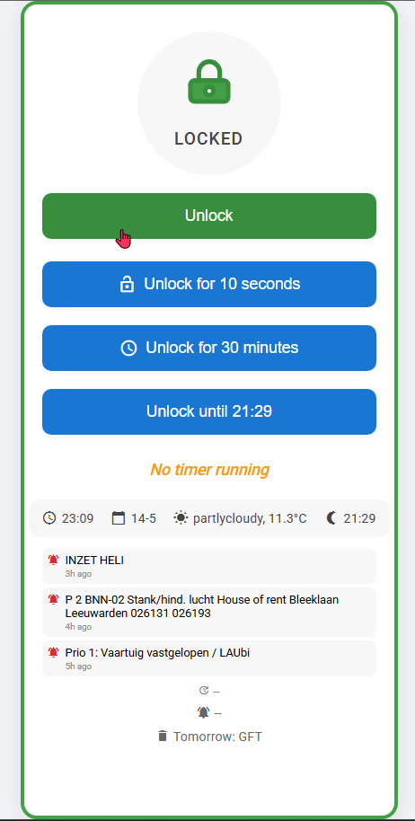

# Lock Control Interface

A simple web interface for controlling a lock via Home Assistant.



## Interface Overview

The interface provides a clean, modern UI for controlling your lock with the following features:

### Main Controls
- **Lock/Unlock Button**: Large toggle button that changes color and icon based on lock state
  - Green when locked
  - Red when unlocked
  - Shows loading state during operations

### Quick Access Timers
- **10 Second Unlock**: Temporarily unlocks the door for 10 seconds
- **30 Minute Unlock**: Keeps the door unlocked for 30 minutes
- **Until Sunset**: Unlocks the door until the next sunset (only available during daytime)

### Status Information
- **Lock Status**: Shows current lock state with visual indicator
- **Timer Display**: Shows countdown when a timer is active
- **Info Bar**: Displays:
  - Current time
  - Current date
  - Weather conditions
  - Sunset time

### Additional Features
- **P2000 Notifications**: Shows recent emergency service notifications
- **Garbage Collection**: Displays next day's garbage collection schedule
- **Debug Mode**: Accessible via URL parameter `?debug` for testing time-based features

## Features

- Clean, modern UI with a lock/unlock button
- Real-time status updates
- Visual feedback for actions
- Error handling and user notifications
- Docker support with customizable paths
- Easy configuration script

## Installation

### Option 1: Using the Configuration Script (Recommended)

1. Clone this repository
2. Run the configuration script:
   ```bash
   ./update_config.sh
   ```
3. Follow the prompts to set up your configuration
4. The script will guide you through the Docker path setup and file copying process

### Option 2: Manual Installation

1. Clone this repository
2. Copy `config.js` to `config.local.js` and update the following values:
   - `HA_TOKEN`: Your Home Assistant long-lived access token
   - `HA_URL`: Your Home Assistant instance URL
   - `DOCKER_PATH`: Your Home Assistant www directory path (default: /config/www/lockcontrol)

## Home Assistant Integration

### File Location
Copy all files to your Home Assistant www directory:
- For Docker: `/config/www/lockcontrol/`
- For Home Assistant OS: `/config/www/lockcontrol/`
- For Home Assistant Supervised: `/config/www/lockcontrol/`

### Required Files
Make sure to copy:
- `lockcontrol.html` (main interface)
- `config.local.js` (your configuration)
- All other `.html` files
- All `.js` files
- All `.css` files

### Docker Setup
If using Docker, ensure your volume mount includes:
```yaml
volumes:
  - /path/to/your/config/www/lockcontrol:/config/www/lockcontrol
```

### Accessing the Interface
After copying the files:
1. Restart Home Assistant or reload the www folder
2. Access the interface at: `http://your-ha-ip:8123/local/lockcontrol/lockcontrol.html`

## Security Notes

- Never commit your `config.local.js` file with real credentials
- Keep your Home Assistant token secure
- Consider using HTTPS for your Home Assistant instance
- Ensure proper file permissions (usually www-data:www-data)

## Dependencies

- Home Assistant instance
- Modern web browser with JavaScript enabled
- Docker (optional, for containerized setup)

## License

MIT License 